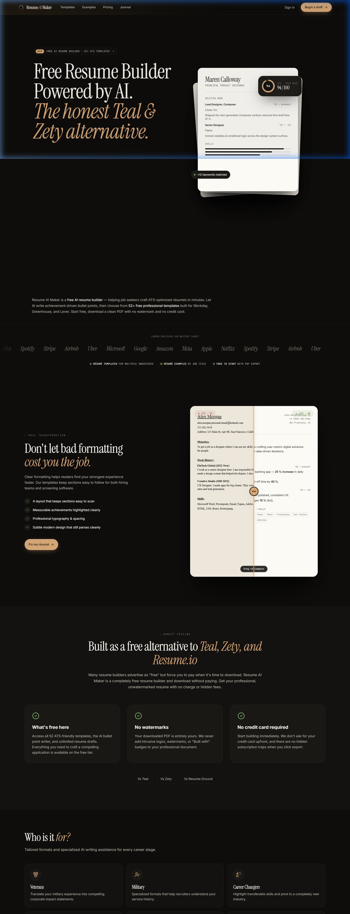
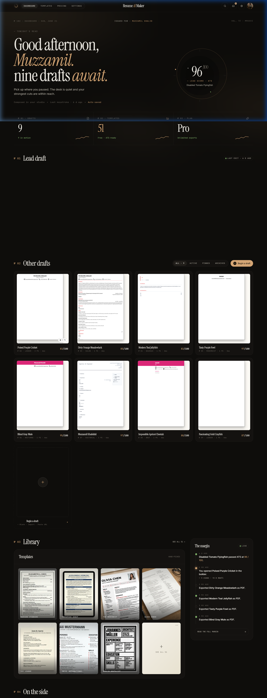
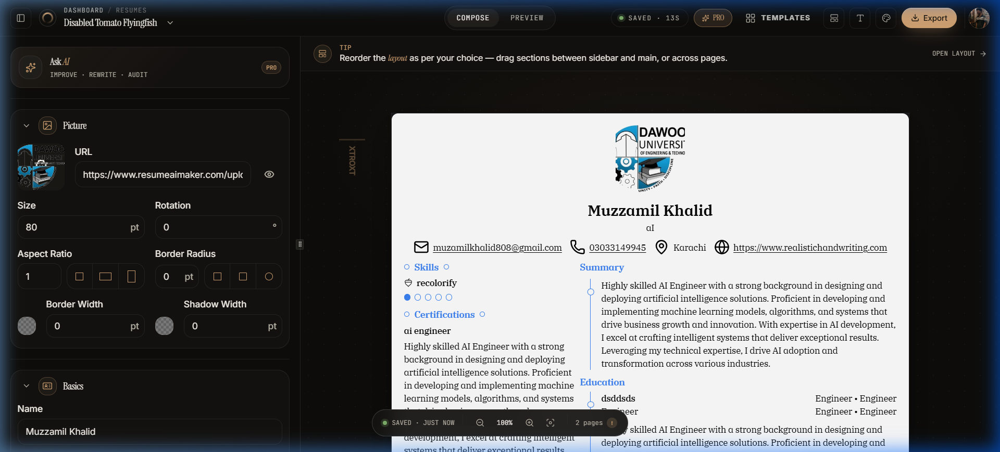
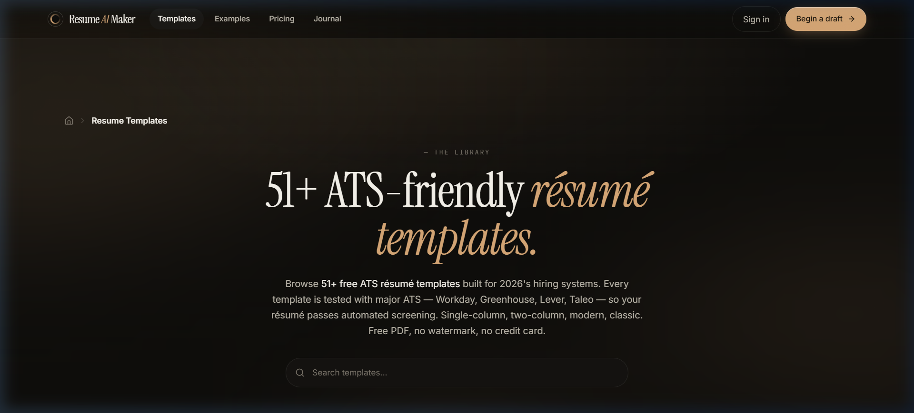
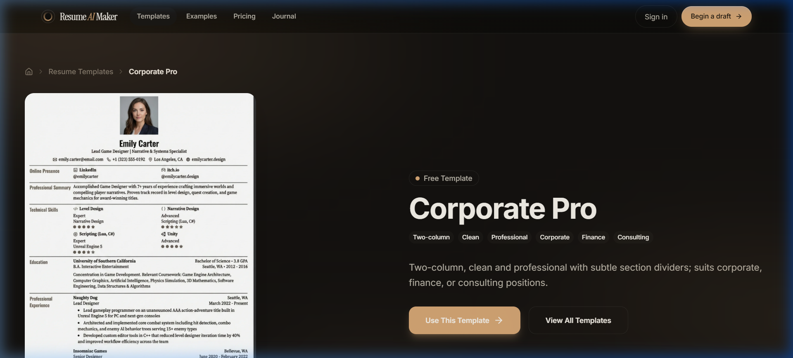
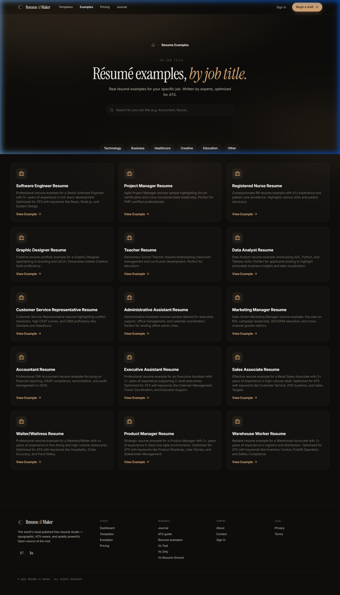
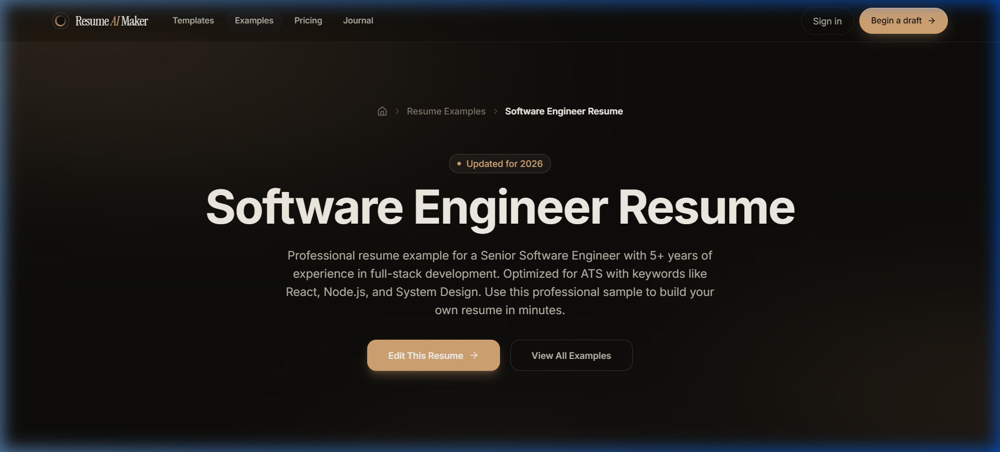
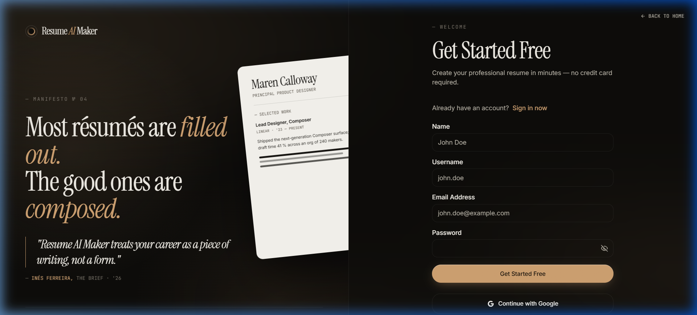
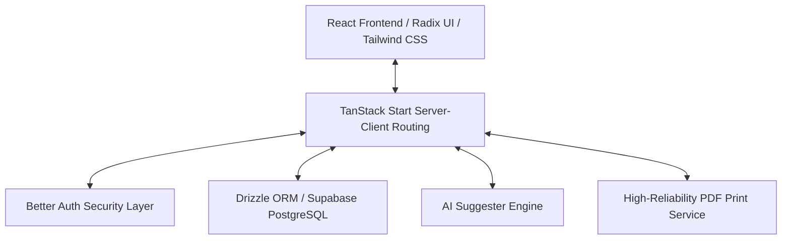

<p align="center">
  
</p>

<h1 align="center">🚀 Resume AI Maker</h1>

<p align="center">
  A free, open-source AI-powered resume builder designed to help job seekers create ATS-friendly resumes that stand out. Engineered with high-performance web technologies, it ensures resumes are structured perfectly to pass Applicant Tracking Systems (ATS) and land on the recruiter's desk.
</p>

<p align="center">
  
  
  
  
  <br>
  
  
</p>

---

## 📌 Table of Contents
* [🛠️ Project Status & Active Development](#️-project-status--active-development)
* [✨ About The Project](#-about-the-project)
  * [Core Value Proposition](#-core-value-proposition)
  * [The Three Motions Workflow](#-the-three-motions-workflow)
* [📸 Interface Gallery](#-interface-gallery)
  * [Web Experience & Dashboard](#-web-experience--dashboard)
  * [Templates, Examples & Flow](#-templates-examples--flow)
* [🛠️ Technology Architecture](#️-technology-architecture)
* [🗺️ Roadmap & Planned Features](#️-roadmap--planned-features)
* [📄 License & Attribution](#-license--attribution)

---

## 🛠️ Project Status & Active Development

> [!IMPORTANT]
> **Active Development Warning**
> I am actively developing this tool! Please note that there may currently be **glitches, minor bugs, or PDF printing issues** which are being resolved as quickly as possible.
> 
> * **Feature Requests & Bug Reports**: If you want to suggest new features, report bugs/issues, or email suggestions, feel free to contact me.
> * **Template Submissions**: If you have any specific type of resume style or layout you want included/supported in the builder, please email it!
> 
> <p align="left">
>   <a href="mailto:muzzamilkhalidai@gmail.com">
>     
>   </a>
> </p>

---

## ✨ About The Project

Modern recruitment relies heavily on Applicant Tracking Systems (ATS) to filter candidates. If your resume isn't formatted correctly, it might never be seen by a human recruiter. **Resume AI Maker** solves this by using the standardized **JSON Resume** schema and layouts engineered to pass ATS parsers while maintaining beautiful, professional typography.

### 💡 Core Value Proposition
* 💸 **100% Free**: Resume AI Maker is completely free for general users, always.
* 🤖 **AI-Powered Suggestions**: Write, rewrite, and optimize descriptions on the fly.
* 📄 **ATS-Optimized Templates**: 52 templates explicitly designed to avoid parsing errors.
* 🔒 **Privacy-First Design**: You own your data. Export your full resume schema as JSON, import it anytime, or host the app locally.

### 🔄 The Three Motions Workflow

```
[1. Compose] ──> [2. Audit] ──> [3. Send]
```

1.  **Compose**: Input your details section-by-section. An **AI Assist** content optimizer helps you rewrite dull resume points into action-driven statements. You can also import existing resume schemas to auto-parse details in real-time.
2.  **Audit**: Our built-in **ATS Margin & Structure Checker** inspects your resume's formatting, margins, and headings to verify compatibility with major screening systems like Workday, Greenhouse, and Lever.
3.  **Send**: Uses a **Smart Hybrid Pagination** layout engine that prevents mid-sentence text splitting across page lines. Our cloud-rendering sync ensures your exported PDF perfectly matches the live preview.

---

## 📸 Interface Gallery

Here is a visual overview of the user experience and pages. All images are captured from the actual application interface.

### 💻 Web Experience & Dashboard

The application features a modern landing page, a dashboard to manage drafts, and a split-screen resume builder.

<table>
  <tr>
    <td width="50%">
      <p align="center"><b>1. Landing Page</b></p>
      
    </td>
    <td width="50%">
      <p align="center"><b>2. Resumes Dashboard</b></p>
      
    </td>
  </tr>
  <tr>
    <td width="50%">
      <p align="center"><b>3. Interactive Builder & Editor</b></p>
      
    </td>
    <td width="50%">
      <p align="center"><b>4. ATS Templates Directory</b></p>
      
    </td>
  </tr>
</table>

### 📂 Templates, Examples & Flow

Our templates directory and real-world examples guide you on how to structure resumes for specific industries.

<table>
  <tr>
    <td width="50%">
      <p align="center"><b>5. Template Detail View (Bronzor)</b></p>
      
    </td>
    <td width="50%">
      <p align="center"><b>6. Interactive Resume Examples</b></p>
      
    </td>
  </tr>
  <tr>
    <td width="50%">
      <p align="center"><b>7. Example Detail (Software Engineer)</b></p>
      
    </td>
    <td width="50%">
      <p align="center"><b>8. User Onboarding / Registration</b></p>
      
    </td>
  </tr>
</table>

---

## 🛠️ Technology Architecture

Resume AI Maker is engineered with modern, type-safe technologies designed for sub-second rendering times.



---

## 🗺️ Roadmap & Planned Features

Here are the features currently planned or under active development:

- [ ] **Printing Fixes**: Resolve layout shift errors during high-resolution cloud printing.
- [ ] **AI Cover Letter Generator**: Generate tailored cover letters matching your resume schema.
- [ ] **LinkedIn Importer**: Import profile data directly from LinkedIn export.
- [ ] **PDF Parser**: Upload a standard resume PDF to automatically extract sections into JSON.
- [ ] **More Resume Layouts**: Integrate new custom, community-submitted layouts.

---

## 📄 License & Attribution

This promotional repository showcases the frontend, UX design, and architectural capabilities of **Resume AI Maker**. 

*Developed with ❤️ to empower job seekers.*
